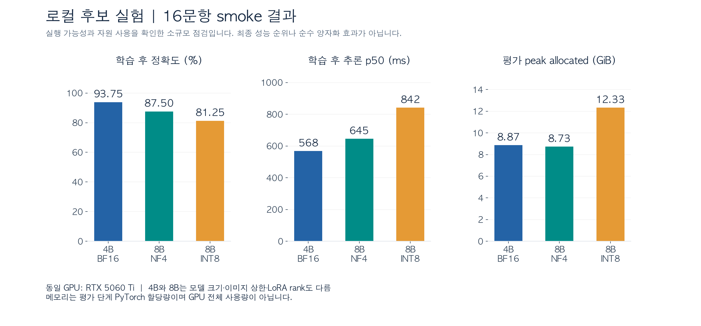
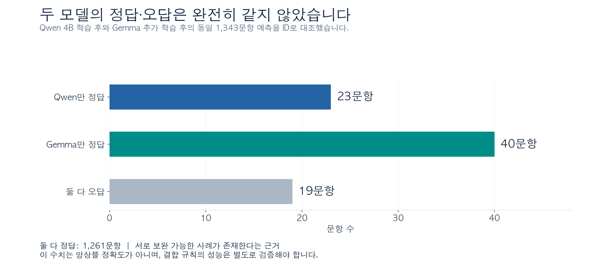
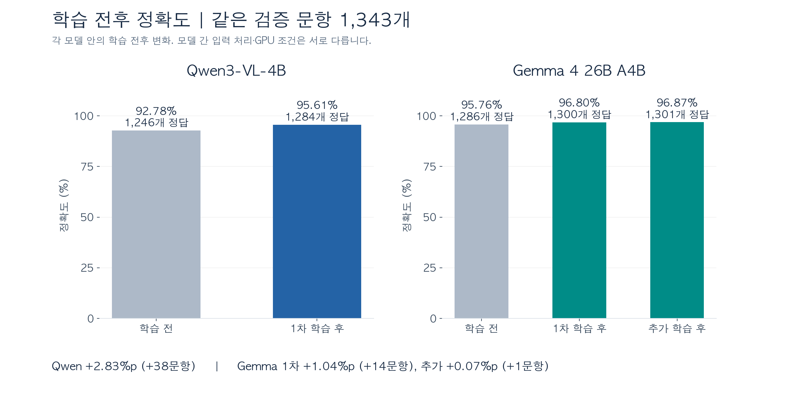
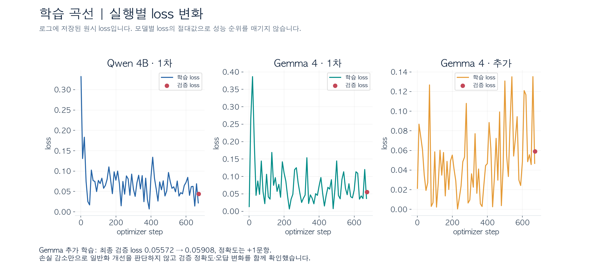

# 01. 모델 선정 이유 · 학습 중 발생한 문제 · 정확도

> **PPT 담당자 전달용** · 2026-09-22 작성 · 윤종서 실험 기록
>
> 핵심 메시지: **로컬에서 학습할 Qwen3-VL-4B와 대형 모델 Gemma 4를 실험했고, 같은 검증 1,343문항에서 각각 최고 95.61%, 96.87%를 기록했다.**
>
> 아래 발표 문장은 로그와 코드에 근거해 재구성했다. 선정 동기를 직접 기록한 개인 메모는 없어, ‘선정 이유’는 관측 결과와 팀 회의 방향을 바탕으로 한 설명이다. 창작한 수치·오류·해결 이력은 포함하지 않았다. 정확도는 내부 검증 점수이며 대회 test/리더보드 점수가 아니다.

## 1. 모델 선정 이유

### 슬라이드 1 — 로컬 실행 가능성과 정확도를 함께 확인했다

**슬라이드에 넣을 문장**

- 이미지·질문·네 개의 보기를 함께 입력하고 `a~d` 한 글자를 출력하는 VLM을 사용했다.
- 로컬 후보로 Qwen3-VL-4B BF16과 Qwen3-VL-8B NF4/INT8을 점검했다.
- 로컬 실험은 Qwen3-VL-4B를 전체 학습으로 확장하고, 별도 고메모리 GPU에서 Gemma 4를 학습했다.
- 모델 크기만으로 선택하지 않고 검증 정확도, 추론 지연, 메모리, 출력 실패를 함께 기록했다.

**발표 설명**

“먼저 로컬 장비에서 후보 모델이 실제로 학습·추론되는지 확인했습니다. 16문항 smoke 실험에서 Qwen3-VL-4B는 15문항을 맞혔고, 학습 후 추론 p50은 약 568ms였습니다. 이후 4B 모델을 전체 학습으로 확장했습니다. 대형 모델은 별도 환경에서 실행해 정확도가 더 올라가는지도 확인했습니다.”

| 후보 | 로그에서 확인한 선택 근거 | 발표에서 맡길 역할 |
|---|---|---|
| Qwen3-VL-4B-Instruct / BF16 | RTX 5060 Ti에서 학습 완료. smoke 15/16, 전체 학습 후 1,284/1,343 | 로컬에서 반복 실험 가능한 주력 후보 |
| Qwen3-VL-8B-Instruct / NF4 | 양자화 설정으로 학습·평가 완료. smoke 14/16 | 더 큰 로컬 모델의 실행 가능성 탐색 |
| Qwen3-VL-8B-Instruct / INT8 | smoke 학습 전 14/16, 학습 후 13/16. 학습 후 p50 약 842ms | 8비트 후보의 소규모 점검 기록 |
| google/gemma-4-26B-A4B-it / BF16 | RTX PRO 6000 Blackwell Server Edition에서 학습 완료. 최종 1,301/1,343 | 높은 정확도를 목표로 한 대형 모델 후보 |

마지막 열은 **발표용 역할 해석**이다. 8B를 탈락시킨 의사결정 메모는 없으므로 “8B가 성능이 나빠 폐기했다”고 단정하지 않는다. Gemma 선정 전 공개 벤치마크를 조사했다는 이력도 이 폴더에서는 확인되지 않는다.

그림 원본: [PNG](assets/02_smoke_tradeoff.png) · [SVG](assets/02_smoke_tradeoff.svg)

**그림 배치:** 3개 패널을 한 장에 배치. 정확도만 확대하지 말고, `16문항 smoke`를 제목에 남긴다.

**해석 범위:** 4B는 이미지 상한 802,816 pixels·LoRA rank 16, 8B는 401,408 pixels·rank 8이다. 모델·입력·학습 조건이 함께 달라지므로 순수한 양자화 효과나 모델 크기의 효과로 해석할 수 없다. 8B 비양자화 기준 결과도 없다.

### 슬라이드 2 — 작은 모델과 큰 모델이 다른 문항을 맞혔다

학습 후 Qwen 4B와 추가 학습 후 Gemma의 문항별 결과를 ID로 맞춰 비교했다. 두 실행은 **검증 ID 1,343개와 정답이 모두 동일**했다.

그림 원본: [PNG](assets/04_complementary_errors.png) · [SVG](assets/04_complementary_errors.svg)

| 결과 조합 | 문항 수 |
|---|---:|
| 둘 다 정답 | 1,261 |
| Qwen만 정답 | 23 |
| Gemma만 정답 | 40 |
| 둘 다 오답 | 19 |

**발표용 문장:** “전체 정확도는 Gemma가 높았지만, Qwen만 맞힌 문항도 23개 있었습니다. 두 모델을 함께 검토할 이유를 평균 정확도뿐 아니라 문항별 결과에서도 찾을 수 있었습니다.”

이는 **결과를 본 뒤의 분석**이다. 최초 선정 당시의 동기나 검증된 앙상블 개선 효과로 바꾸어 말하지 않는다. 이 문서에서는 앙상블 점수를 계산하지 않았다.

## 2. 학습 중 발생한 문제

### 슬라이드 3 — 환경·실행 설정 문제를 기록하고 다음 실험에서 확인했다

| 문제 | 실제 관측 | 후속 기록·대응 방향 | 발표할 수 있는 결론 |
|---|---|---|---|
| 존재하지 않는 모델 revision | 9/17 `061139` 실행이 `revision=test1`로 로딩 실패. `RevisionNotFoundError` | 뒤 실행에서 revision을 `null`로 설정해 로딩. 이후 전체 실행은 실제 commit SHA를 지정 | 임의 버전 문자열 대신 실제 모델 버전을 확인·고정할 필요 |
| Gemma 학습 의존성 충돌 | 9/21 `132929` 실행은 학습 전 평가 뒤 `torchao 0.10.0` 호환성 `ImportError`로 실패. 오류 메시지는 `>0.16.0` 지원을 명시 | 뒤 smoke와 전체 학습은 완료. 실제 uninstall/upgrade 명령은 실행 폴더에 없음 | 평가 성공만으로 학습 환경 호환성을 보장할 수 없음 |
| `full` 표기와 실제 실행 규모 불일치 | 9/21 `141101` Gemma 실행은 이름·profile이 full이지만 실제 학습 16개·검증 8개·2 step | 뒤 `141248` 실행에서 학습 5,371개·검증 1,343개·672 step 확인 | profile 이름만 바꾸지 말고 실제 선택 ID와 step 확인 필요 |
| 평가가 끝난 뒤 결과 등록 충돌 | 9/22 `002915` Qwen 실행은 학습 후 1,280/1,343을 기록했지만 `best_model` 비교 조건 충돌로 최종 status가 failed | 기존 best는 9/21 Qwen 95.61%로 유지. 별도 출력 폴더 사용은 오류 메시지의 안내이며 실제 재등록 성공 기록은 없음 | 학습·평가 결과와 최종 등록 성공 여부를 구분해야 함 |

**발표 설명**

“문제가 생긴 실행은 설정과 오류를 남겨 두었습니다. 특히 full이라는 이름으로 실행했는데 실제로는 smoke 표본이 사용된 기록이 있었습니다. 그래서 실행 이름뿐 아니라 실제 데이터 수와 학습 step까지 확인했습니다. 또 학습이 끝나도 결과 등록에서 실패할 수 있어, 단계별 상태와 산출물을 함께 확인했습니다.”

**추정하지 않은 부분:** `status=training` 또는 `evaluating_before`에서 끝난 폴더는 미완료 기록이다. 그 이유가 사용자 중단·런타임 종료·메모리 부족 중 무엇인지는 알 수 없다. 일부 status의 “OOM이면…” 문구는 안내이며, 실제 OOM 발생 증거가 아니다. `full` 규모 불일치도 셀 재실행 누락 가능성은 있지만 직접 원인이 기록되어 있지 않다.

### 슬라이드 4 — 정답 외의 문장을 출력하는 형식 오류도 평가했다

Gemma 첫 전체 학습 전에는 **형식 오류 5건 / 실행 오류 0건**이 있었다. 모델이 설명을 덧붙이거나 복수 답을 출력해 `a~d` 한 글자 규칙을 벗어났다.

- 실제 출력 예: `b, d` 뒤에 설명이 이어짐 (`train_2047.jpg`).
- 다른 예: `질문에서 요구하는 '소백청국장'이라는 메뉴는 사진` (`train_0668.jpg`).
- 첫 전체 학습 후 형식 오류는 **0건**으로 줄었다. 추가 학습 후에도 0건이다.
- 실패 문항도 전체 1,343문항 분모에 포함했다.

**발표용 문장:** “정답 여부뿐 아니라 제출 규칙에 맞는 출력인지도 평가했습니다. Gemma는 학습 전 설명문이나 복수 답을 내는 사례가 5건 있었고, 학습 후에는 같은 검증셋에서 형식 오류가 나타나지 않았습니다.”

이는 학습 전후의 관측이다. LoRA나 프롬프트 중 특정 요소 하나가 원인이라고 분리 검증한 결과는 아니다.

## 3. 정확도

### 슬라이드 5 — 전체 검증에서 Qwen은 +2.83%p, Gemma는 최종 96.87%

**평가 기준**

- `train.csv` 6,714개 중 학습 5,371개 / 검증 1,343개, seed 42.
- 동일 이미지 파일의 SHA-256을 기준으로 같은 분할에 묶는 manifest 사용.
- 정확도 = 정답 수 ÷ 전체 검증 수. 출력 형식 오류와 실행 오류도 분모에 포함.
- 아래 대표 실행은 실제 selected IDs가 동일하다. 단, Qwen과 Gemma의 이미지 처리·문맥·템플릿·GPU는 다르다.

그림 원본: [PNG](assets/01_full_accuracy.png) · [SVG](assets/01_full_accuracy.svg)

| 실행 | 학습 전 | 학습 후 | 변화 | 정답 수 변화 |
|---|---:|---:|---:|---:|
| Qwen3-VL-4B 첫 전체 학습 | 92.78% (1,246/1,343) | **95.61% (1,284/1,343)** | **+2.83%p** | +38 |
| Gemma 4 첫 전체 학습 | 95.76% (1,286/1,343) | **96.80% (1,300/1,343)** | **+1.04%p** | +14 |
| Gemma 4 기존 adapter 추가 학습 | 96.80% (1,300/1,343) | **96.87% (1,301/1,343)** | **+0.07%p** | +1 |
| Qwen3-VL-4B 재실행¹ | 92.70% (1,245/1,343) | 95.31% (1,280/1,343) | +2.61%p | +35 |

¹ 학습·평가 지표는 남아 있지만 `best_model` 등록 충돌로 최종 status는 failed. 대표 완료 결과와 구분한다. 앞 Qwen 실행과 검증 ID는 같지만 `eval_signature`가 다르므로 완전히 동일한 조건의 재현 실험으로 취급하지 않는다.

**Gemma 추가 학습의 출발점:** 9/22 실행의 `adapter_path`는 9/21 전체 학습 adapter를 가리킨다. 이전 after의 adapter 해시와 다음 before의 해시도 같다. 따라서 마지막 96.87%를 “기본 모델에서 1 epoch만 학습한 성능”이라고 표시하지 않는다. 두 실행은 각각 1 epoch이며, 추가 실행은 `resume_checkpoint`가 아닌 기존 adapter 로드로 시작했다.

**발표 설명**

“같은 1,343문항 검증셋에서 Qwen 4B는 학습 후 정답이 38개 늘어 95.61%가 됐습니다. Gemma는 첫 학습으로 96.80%를 기록했고, 기존 어댑터를 추가 학습해 96.87%가 됐습니다. 마지막 향상은 한 문항 차이이므로 큰 성능 향상으로 해석하지 않았습니다.”

### 슬라이드 6 — 정확도와 실행 비용을 함께 기록했다

| 대표 결과 | 정확도 | 추론 p50 / p95 | 평가 peak allocated | 학습 peak allocated | 형식 / 실행 오류 | GPU |
|---|---:|---:|---:|---:|---:|---|
| Qwen 4B 학습 후 | 95.61% | 554.6 / 654.7 | 8.93 | 10.61 | 0 / 0 | RTX 5060 Ti |
| Gemma 첫 학습 후 | 96.80% | 625.8 / 640.9 | 48.38 | 48.81 | 0 / 0 | RTX PRO 6000 Blackwell Server |
| Gemma 추가 학습 후 | 96.87% | 615.8 / 629.9 | 48.38 | 48.80 | 0 / 0 | RTX PRO 6000 Blackwell Server |

- 단위: 지연시간 ms, 메모리 GiB. 파일 키는 `_gb`지만 코드가 bytes ÷ 2³⁰으로 계산한다.
- PyTorch **peak allocated**이며 GPU 전체 사용량이 아니다. 평가 메모리와 학습 메모리는 측정 단계가 다르다.
- Qwen의 형식/실행 오류 분리는 JSONL의 `status`를 재집계했다. 원래 Qwen metrics는 총 failures만 제공한다.
- Qwen과 Gemma의 GPU·런타임이 다르므로 이 표로 모델 자체의 속도 우열을 결론 내리지 않는다.
- Qwen 학습 summary의 `peak_reserved`는 약 24.95 GiB로 기록되어 장비의 약 15.93 GiB와 맞지 않는다. 이 값의 원인은 미확인이라 대표 메모리 그림에는 사용하지 않았다.

그림 원본: [PNG](assets/03_training_loss.png) · [SVG](assets/03_training_loss.svg)

**추가 학습 해석:** Gemma의 최종 검증 loss는 0.05572 → 0.05908로 높아졌고, 정확도는 한 문항만 늘었다. 문항별로는 기존 오답 7개를 맞히고 기존 정답 6개를 틀렸다. 따라서 지속적인 학습이 모든 문항을 개선했다거나, 과적합이 확정됐다고 단정하지 않는다.

### PPT에 남길 숫자 3개

1. **Qwen3-VL-4B: 95.61% / +2.83%p** — 로컬 모델의 학습 전후 변화.
2. **Gemma 4: 96.87%** — 기존 adapter 추가 학습 후 내부 검증 최고 기록.
3. **형식 오류 5 → 0건** — Gemma 첫 전체 학습 전후 출력 안정성 변화.

## 부록 A. 실행 기록 전체 목록

시각은 `RUN_ID`의 UTC 문자열 기준이다. 날짜만으로 한국 시간 실험 순서를 다시 해석하지 않는다. 상태는 제공된 파일의 마지막 저장 상태다.

| RUN_ID | 모델 / 설정 | 실제 학습·검증 수 | 저장 상태 | 결과 요약 |
| `20260917T061139813174Z-smoke-none` | Qwen3-VL-4B-Instruct / none | 64 / 16 | failed | 최종 지표 없음 |
| `20260917T061333860761Z-smoke-none` | Qwen3-VL-4B-Instruct / none | 64 / 16 | evaluating_before | 최종 지표 없음 |
| `20260917T062929395216Z-smoke-none` | Qwen3-VL-4B-Instruct / none | 64 / 16 | complete | 전 93.75% → 후 93.75% |
| `20260918T003616312368Z-smoke-nf4` | Qwen3-VL-8B-Instruct / nf4 | 64 / 16 | complete | 전 87.50% → 후 87.50% |
| `20260918T004620310236Z-smoke-int8` | Qwen3-VL-8B-Instruct / int8 | 64 / 16 | complete | 전 87.50% → 후 81.25% |
| `20260920T232342620467Z-full-none` | Qwen3-VL-4B-Instruct / none | 5,371 / 1,343 | complete | 평가 92.78% |
| `20260921T001126826670Z-full-none` | Qwen3-VL-4B-Instruct / none | 5,371 / 1,343 | complete | 전 92.78% → 후 95.61% |
| `20260921T132929156217Z-gemma4-full-bf16` | gemma-4-26B-A4B-it / none | 5,371 / 1,343 | failed | 전 95.76% |
| `20260921T140554168483Z-gemma4-smoke-bf16` | gemma-4-26B-A4B-it / none | 16 / 8 | complete | 전 87.50% → 후 87.50% |
| `20260921T141101087394Z-gemma4-full-bf16` | gemma-4-26B-A4B-it / none | 16 / 8 | complete | 전 87.50% → 후 87.50% → full 표기지만 소규모 |
| `20260921T141248166816Z-gemma4-full-bf16` | gemma-4-26B-A4B-it / none | 5,371 / 1,343 | complete | 전 95.76% → 후 96.80% |
| `20260921T231710676165Z-full-none` | Qwen3-VL-4B-Instruct / none | 5,371 / 1,343 | training | 전 92.70% |
| `20260921T234546938796Z-full-none` | Qwen3-VL-4B-Instruct / none | 5,371 / 1,343 | evaluating_before | 최종 지표 없음 |
| `20260922T002054858922Z-gemma4-full-bf16` | gemma-4-26B-A4B-it / none | 5,371 / 1,343 | complete | 전 96.80% → 후 96.87% |
| `20260922T002915190449Z-full-none` | Qwen3-VL-4B-Instruct / none | 5,371 / 1,343 | failed | 전 92.70% → 후 95.31% |

총 **15개 실행 폴더**. complete 9개, failed 3개, 중간 상태 3개다. complete 안에는 평가 전용 실행과 소규모 점검도 있으므로 “전체 학습 9회 성공”을 뜻하지 않는다.

## 부록 B. 근거 위치와 재검산

핵심 수치는 요약 JSON과 문항별 JSONL을 대조했다. metrics와 대응 JSONL이 모두 있는 **21개 평가 단계**에서 문항 수·정답 수가 일치했다. 기존 GPU 실험 로그 분석이며 이번 문서 작성 과정에서 모델을 다시 학습한 것은 아니다.

| 표기 | 원본 실행 폴더 | 확인 파일 |
| Q4S | `20260917T062929395216Z-smoke-none` | [config.json](../종서/training_runs/20260917T062929395216Z-smoke-none/config.json) · [before_metrics.json](../종서/training_runs/20260917T062929395216Z-smoke-none/before_metrics.json) · [after_metrics.json](../종서/training_runs/20260917T062929395216Z-smoke-none/after_metrics.json) · [training_history.json](../종서/training_runs/20260917T062929395216Z-smoke-none/training_history.json) |
| Q8N | `20260918T003616312368Z-smoke-nf4` | [config.json](../종서/training_runs/20260918T003616312368Z-smoke-nf4/config.json) · [before_metrics.json](../종서/training_runs/20260918T003616312368Z-smoke-nf4/before_metrics.json) · [after_metrics.json](../종서/training_runs/20260918T003616312368Z-smoke-nf4/after_metrics.json) · [training_history.json](../종서/training_runs/20260918T003616312368Z-smoke-nf4/training_history.json) |
| Q8I | `20260918T004620310236Z-smoke-int8` | [config.json](../종서/training_runs/20260918T004620310236Z-smoke-int8/config.json) · [before_metrics.json](../종서/training_runs/20260918T004620310236Z-smoke-int8/before_metrics.json) · [after_metrics.json](../종서/training_runs/20260918T004620310236Z-smoke-int8/after_metrics.json) · [training_history.json](../종서/training_runs/20260918T004620310236Z-smoke-int8/training_history.json) |
| Q4 | `20260921T001126826670Z-full-none` | [config.json](../종서/training_runs/20260921T001126826670Z-full-none/config.json) · [before_metrics.json](../종서/training_runs/20260921T001126826670Z-full-none/before_metrics.json) · [after_metrics.json](../종서/training_runs/20260921T001126826670Z-full-none/after_metrics.json) · [training_history.json](../종서/training_runs/20260921T001126826670Z-full-none/training_history.json) |
| G1 | `20260921T141248166816Z-gemma4-full-bf16` | [config.json](../종서/training_runs/20260921T141248166816Z-gemma4-full-bf16/config.json) · [before_metrics.json](../종서/training_runs/20260921T141248166816Z-gemma4-full-bf16/before_metrics.json) · [after_metrics.json](../종서/training_runs/20260921T141248166816Z-gemma4-full-bf16/after_metrics.json) · [training_history.json](../종서/training_runs/20260921T141248166816Z-gemma4-full-bf16/training_history.json) |
| G2 | `20260922T002054858922Z-gemma4-full-bf16` | [config.json](../종서/training_runs/20260922T002054858922Z-gemma4-full-bf16/config.json) · [before_metrics.json](../종서/training_runs/20260922T002054858922Z-gemma4-full-bf16/before_metrics.json) · [after_metrics.json](../종서/training_runs/20260922T002054858922Z-gemma4-full-bf16/after_metrics.json) · [training_history.json](../종서/training_runs/20260922T002054858922Z-gemma4-full-bf16/training_history.json) |
| Q4R | `20260922T002915190449Z-full-none` | [config.json](../종서/training_runs/20260922T002915190449Z-full-none/config.json) · [before_metrics.json](../종서/training_runs/20260922T002915190449Z-full-none/before_metrics.json) · [after_metrics.json](../종서/training_runs/20260922T002915190449Z-full-none/after_metrics.json) · [training_history.json](../종서/training_runs/20260922T002915190449Z-full-none/training_history.json) |

추가 문제 기록:

- revision 오류: [status.json](../종서/training_runs/20260917T061139813174Z-smoke-none/status.json)
- torchao 오류: [status.json](../종서/training_runs/20260921T132929156217Z-gemma4-full-bf16/status.json)
- full/표본 불일치: [selected_ids.json](../종서/training_runs/20260921T141101087394Z-gemma4-full-bf16/selected_ids.json)
- 결과 등록 오류: [status.json](../종서/training_runs/20260922T002915190449Z-full-none/status.json)
- Qwen 선택 결과: [best_model.json](../종서/training_runs/best_model.json)

**PPT 제작 지침:** 본문 슬라이드 1~6을 순서대로 사용하고, 실행 전체 목록과 상세 경로는 백업 슬라이드로 옮긴다. 그림은 PNG를 바로 넣거나 SVG를 사용해 확대한다. `assets` 폴더를 Markdown과 함께 보관해야 그림이 열린다.
