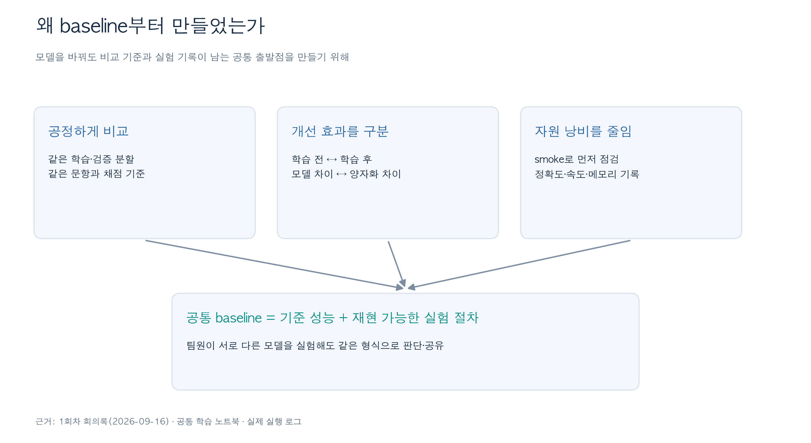
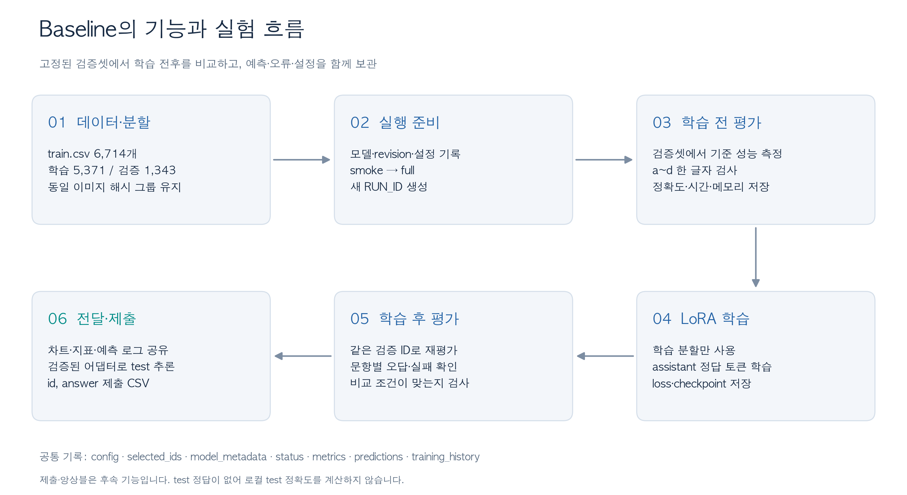
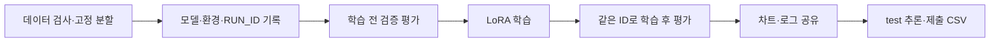

# 02. Baseline 설계 목적과 기능

> **PPT 담당자 전달용** · 2026-09-22 작성
>
> 핵심 메시지: **여러 모델을 같은 기준으로 비교하고, 학습에 따른 변화와 실패 원인을 추적하기 위해 baseline부터 만들었다.**
>
> 이 문서는 1회차 회의록, 공통 학습 노트북, Gemma 확장 노트북, 종서의 실제 실행 로그를 바탕으로 구성했다. 목적 설명은 확인된 설계와 팀 방향을 발표 문장으로 재구성한 것이다. 당시 개인의 동기를 직접 인용한 기록은 아니다.

## 1. 무엇을 위해 baseline부터 만들었는가

### 슬라이드 1 — 모델을 고르기 전에 비교 기준부터 만들었다

**슬라이드에 넣을 문장**

- 팀원이 서로 다른 모델을 실험하므로, 같은 데이터와 같은 채점 기준이 필요했다.
- 학습 전 성능을 먼저 측정해야 학습으로 얼마나 개선됐는지 알 수 있었다.
- 로컬 장비에서 정확도뿐 아니라 속도와 메모리까지 확인해야 했다.
- 성공·실패 기록을 남겨 다른 사람이 결과를 이해하고 재현할 수 있게 했다.

그림 원본: [PNG](assets/05_baseline_purpose.png) · [SVG](assets/05_baseline_purpose.svg)

**발표 설명**

“각자 다른 모델을 실험하더라도 결과를 비교할 수 있도록 baseline부터 만들었습니다. 학습·검증 데이터를 고정하고, 학습 전후 성능을 같은 방식으로 측정했습니다. 정확도뿐 아니라 추론 시간과 메모리, 출력 오류도 기록해서 실제 실행할 수 있는 모델인지 함께 판단했습니다.”

### 슬라이드 2 — Baseline에는 ‘기준 성능’과 ‘공통 절차’가 있다

| 구분 | 의미 | 이 프로젝트에서의 역할 |
|---|---|---|
| 기준 성능 | 개선 여부를 판단할 출발점 | 모델별 학습 전 정확도. 1회차 회의에서는 Colab 대형 모델을 팀 기준으로 삼는 방향도 결정 |
| 공통 실험 절차 | 모든 실험에 적용할 데이터·학습·평가·기록 방식 | 같은 분할, 엄격한 출력 검사, 학습 전후 평가, 설정과 로그 저장 |

**기준이 있어야 답할 수 있는 질문**

| 알고 싶은 것 | 비교 방법 | 필요한 조건 |
|---|---|---|
| 학습이 도움이 됐는가? | 같은 모델의 학습 후 − 학습 전 | 검증 ID·프롬프트·입력 처리·채점 기준 유지 |
| 로컬 후보가 대형 모델에 얼마나 가까운가? | 로컬 후보와 대형 모델의 정확도 | 같은 검증 문항을 사용하고 입력 조건 차이를 공개 |
| 양자화가 성능에 영향을 줬는가? | 같은 가중치의 양자화 후 − 전 | 원본 revision·adapter·평가 조건을 같게 두고 양자화만 변경 |
| 실제 장비에서 쓸 수 있는가? | 지연시간·메모리·실패 수 확인 | 장비·런타임·측정 범위를 함께 기록 |

**실제 기록에 연결할 예:** Qwen 4B는 학습 전 92.78%에서 학습 후 95.61%로 +2.83%p 변화했다. 반면 4B BF16과 8B NF4는 모델과 입력 설정도 다르므로 그 차이를 “양자화로 잃은 정확도”로 계산하지 않는다.

**용어 주의:** 실제 Gemma 실행의 `role`은 `local`, `task`는 `train`으로 저장되어 있다. 고메모리 Colab 환경에서 실행했더라도 로그상 `colab_baseline` 평가 전용 실행이라고 표기하면 안 된다. Gemma의 학습 전 지표는 대형 모델의 출발 성능으로 설명할 수 있다.

## 2. Baseline 기능

### 슬라이드 3 — 데이터 준비부터 학습·평가·제출까지 연결했다

그림 원본: [PNG](assets/06_baseline_flow.png) · [SVG](assets/06_baseline_flow.svg)

**발표 설명**

“먼저 데이터를 나누고 실험 설정을 저장합니다. 작은 smoke 실행에서 동작을 점검한 다음 전체 학습으로 확장합니다. 학습 전에 검증 성능을 측정하고, 학습이 끝나면 같은 문항으로 다시 평가합니다. 마지막에는 예측과 지표를 공유하고, 학습한 모델로 제출 파일을 만듭니다.”

수정 가능한 구조도 원문:

### 슬라이드 4 — 비교 가능한 데이터를 만들었다

| 기능 | 실제 설계 | 필요한 이유 |
|---|---|---|
| 정답 있는 데이터만 학습·검증 | train.csv 6,714개 사용 | 정답 구조가 불확실한 응답이나 test를 학습 정답으로 쓰지 않음 |
| 팀 공통 80/20 분할 | 학습 5,371개, 검증 1,343개, seed 42 | 실험마다 문항이 바뀌어 점수가 달라지는 혼선을 줄임 |
| 동일 이미지 그룹 유지 | 이미지 파일 SHA-256이 같으면 같은 분할에 배치 | 같은 파일이 학습과 검증 양쪽에 들어가는 누수 방지 |
| 분할 재사용·검사 | manifest에 ID와 data_signature 저장 | 데이터나 seed가 달라지면 기존 분할을 그대로 쓰지 못하게 검사 |
| 실제 사용 ID 기록 | selected_ids.json | smoke와 full, 일부 표본 실행을 사후에 구분 |

**강조할 장면:** 실제로 이름이 `full`인데 학습 16개·검증 8개만 사용한 실행이 발견됐다. `selected_ids.json`과 실제 지표의 `n`이 있어 최종 정확도 표에서 구분할 수 있었다.

동일 파일 해시 검사는 재촬영·크롭·재압축한 유사 이미지까지 모두 검출하는 기능은 아니다. “모든 데이터 누수를 완전히 제거했다” 대신 “동일 이미지 파일이 두 분할에 겹치지 않도록 검사했다”라고 설명한다.

### 슬라이드 5 — 작은 실행으로 점검하고 학습 전후를 같은 방식으로 평가했다

| 기능 | 동작 | 로그·코드에서 확인한 범위 |
|---|---|---|
| smoke / full 분리 | 적은 표본으로 로딩·학습·평가 점검 후 전체 실행 | Qwen smoke 64/16·8 step, Gemma smoke 16/8·2 step. 실제 실행 ID 수로 재확인 |
| 공통 입력 구성 | 이미지 + 질문 + a~d 선택지 | 모델별 processor와 chat template 적용. 추론 입력에서 정답 제외 |
| 엄격한 답안 검사 | 공백을 제거한 뒤 소문자 한 글자 a~d만 인정 | 설명문·복수 답·다른 출력은 형식 오류 |
| LoRA 학습 | 주요 가중치를 동결하고 language attention에 adapter 적용 | 초기 공통 코드와 Gemma 확장에 구현 |
| 정답 응답 부분만 학습 | 질문·이미지·프롬프트·패딩은 loss에서 제외 | assistant 응답과 종료 토큰에 대한 supervision. 토큰 경계 검사 |
| 학습 전후 평가 | 동일한 검증 ID로 before/after 측정 | 정확도 개선을 직접 계산 가능 |
| 실패 포함 채점 | 오류가 난 문항도 검증 분모에 포함 | 실패를 제외해 정확도가 높아지는 문제 방지 |
| 자원·실패 기록 | p50/p95, peak allocated/reserved, raw output, status | 정확도 외에 실행 안정성도 검토 |

**발표용 문장:** “학습이 돌아가는지만 확인하지 않고, 모델이 무엇을 정답으로 학습하는지와 출력 형식까지 검사했습니다. 학습 전후에 같은 문항을 사용하고, 실패 문항도 포함해 성능을 계산했습니다.”

**실제 사례:** Gemma는 첫 전체 학습 전 형식 오류 5건이 있었고 학습 후에는 0건이었다. 출력 원문을 저장했기 때문에 단순 오답과 형식 오류를 구분할 수 있었다.

### 슬라이드 6 — 결과를 나중에 설명할 수 있게 저장했다

| 보관 파일 | 담긴 내용 | 활용 |
|---|---|---|
| config.json | 모델·학습률·양자화·입력 상한·profile 등 | 무엇을 바꾼 실험인지 확인 |
| model_metadata.json | 실제 revision, GPU, 패키지, adapter 해시 | 모델과 환경 식별 |
| split_manifest.json / selected_ids.json | 공통 분할과 실제 실행 표본 | 비교 가능 여부와 규모 확인 |
| status.json | 진행 상태·실패 원인 | 완료와 실패·중간 상태 구분 |
| before/after_metrics.json | 정확도, 지연시간, 메모리, 실패 | 결과 표와 학습 전후 비교 |
| before/after_predictions.jsonl | ID별 예측 원문·정답·오류 | 오답 분석·형식 오류 분석·문항별 비교 |
| training_history.json / training_summary.json | step별 loss·학습률, 최종 loss와 시간 | 학습 곡선과 추가 학습 효과 확인 |
| checkpoints / adapter | 학습 상태와 학습된 adapter | 조건이 맞는 학습 재개·추론 |
| charts | Plotly HTML 차트 | 팀 공유 및 결과 검토 |

**비교 조건 검사**

- `eval_signature`: 검증 ID, 데이터, 프롬프트, 입력·생성 설정 등을 묶어 비교 조건을 식별한다.
- `checkpoint_signature`: 원본 모델과 adapter 등 가중치 조건을 식별한다.
- `timing_signature`: 장비·런타임이 다른 속도 측정을 분리한다.
- `training_identity`: 재개 시 데이터·모델·설정이 맞는지 확인한다.

**발표용 문장:** “실험 결과를 정확도 한 줄로 남기지 않았습니다. 데이터와 모델 버전, 예측 원문, 오류 상태까지 저장해 결과가 달라졌을 때 어느 조건이 달라졌는지 추적할 수 있게 했습니다.”

### 슬라이드 7 — 결과 공유와 제출 기능으로 확장했다

**시각화**

학습·검증 loss, 학습률, 학습 전후 정확도, 혼동행렬, 추론 지연시간, 메모리 사용량을 Plotly HTML로 저장한다. 이 전달자료의 그림은 기존 로그를 다시 읽어 PPT 삽입용 PNG/SVG로 만든 것이다.

**모델별 확장**

공통 평가·저장 규칙은 유지하되 모델별 입력과 학습 처리를 추가했다. 현재 확인한 초기 `TEAM_MODEL_TRAINING.ipynb`의 로더는 Qwen2.5-VL 전용이다. 이후 제공된 실행 로그에서는 Qwen3-VL과 Gemma 4 학습을 확인할 수 있다. Gemma 확장 노트북은 별도로 확인했지만, 이 작업에서 Qwen3-VL 실행 당시의 노트북 원본은 찾지 못했다. 따라서 “처음부터 모델 이름만 바꾸면 모든 VLM을 지원했다”는 설명은 피한다.

**제출**

- Gemma 확장에는 test 예측과 단일 `id, answer` CSV 생성 기능이 있다.
- 팀 공통 노트북과 Gemma 확장에 제출 CSV 다수결 결합 기능이 있다.
- 제출 CSV의 ID·답안·중복·ID 집합을 검사하고, 같은 ID의 답을 결합한다.
- 동률은 입력 파일 목록에서 먼저 등장하는 답을 우선하므로 입력 순서를 기록해야 한다.
- 검증 예측 결합과 test 제출 생성은 별개다. test에는 정답이 없으므로 로컬에서 test 정확도를 계산하지 않는다.

제출·앙상블은 **후속 확장 기능**으로 설명한다. 초기 baseline의 모든 기능이 최초부터 존재했다고 주장하지 않는다.

## 부록 A. PPT에 바로 쓸 짧은 버전

**왜 만들었는가 — 한 장 요약**

> 각자 다른 모델을 실험해도 같은 기준으로 비교하기 위해 baseline부터 만들었다. 공통 검증셋과 채점 기준을 고정하고, 학습 전후 성능·실행 비용·실패를 함께 기록했다.

**무엇을 만들었는가 — 한 장 요약**

> 데이터 분할 → 실험 설정 → 학습 전 평가 → LoRA 학습 → 같은 검증셋 재평가 → 결과 시각화까지 이어지는 공통 절차를 만들었다. 이후 모델별 입력 처리와 제출·앙상블 기능을 확장했다.

**무엇이 남았는가 — 한 장 요약**

> 정확도뿐 아니라 설정, 모델 버전, 실제 사용 ID, 예측 원문, 오류, 학습 곡선이 남았다. 이 기록으로 Qwen의 +2.83%p 개선, Gemma의 형식 오류 5→0건, 추가 학습의 +1문항 변화를 구분해 설명할 수 있었다.

권장 배치: 발표 시간이 짧으면 슬라이드 1·3·6만 사용하고 나머지는 발표자 노트로 활용한다. 두 문서를 연속 발표할 때는 baseline 목적·흐름을 먼저 소개한 뒤 모델 선정·문제·정확도로 넘어가도 자연스럽다.

## 부록 B. 구현 근거와 확인 범위

| 근거 | 확인 내용 |
|---|---|
| [MEETING_01.md](/Users/yunjongseo/Downloads/ssafy-16-2-ai-recovered/MEETING_01.md) | 2026-09-16 팀 회의: 대형 모델 기준 성능, 로컬 모델 양자화 실험, 80/20 분할 방향 |
| [TEAM_MODEL_TRAINING.ipynb](/Users/yunjongseo/Downloads/ssafy-16-2-ai-recovered/TEAM_MODEL_TRAINING.ipynb) | 초기 공통 학습·평가·차트·앙상블 구현 |
| [EXPERIMENT_AND_NOTION_GUIDE.md](/Users/yunjongseo/Downloads/ssafy-16-2-ai-recovered/EXPERIMENT_AND_NOTION_GUIDE.md) | 실행 순서, 공유할 파일, smoke/full과 양자화 비교 구분 |
| [GEMMA4_G4_TRAINING.ipynb](/Users/yunjongseo/Documents/Codex/2026-09-21/wlr/outputs/GEMMA4_G4_TRAINING.ipynb) | Gemma 전용 로더·학습·평가·제출 확장 구현 |
| 종서/training_runs | 실제 Qwen3-VL·Gemma 실행 설정과 결과. 세부 실행 ID는 첫 번째 문서 참조 |

노트북 위치는 이 컴퓨터의 절대 경로다. 전달받는 사람에게는 본문과 그림만으로 내용을 이해할 수 있게 구성했으며, 원본 코드를 확인하려면 해당 노트북을 별도로 전달받아야 한다.

**코드 위치 안내:** 아래 셀 번호는 문서를 만들 때 읽은 notebook JSON의 **0부터 시작하는 셀 인덱스**다. 셀 삽입·삭제 후에는 함수 이름으로 찾는다.

- 공통 노트북 셀 6: `prepare_split`, `parse_answer`, `assistant_labels`, `encode_row`, `load_model`, `create_run`, `evaluate_model`, `train_adapter`, `render_charts`, `compare_runs`.
- 공통 노트북 셀 8: 분할 준비와 실제 학습·검증 표본 선택.
- 공통 노트북 셀 10: 학습 전 평가 → 학습 → 학습 후 평가 및 상태 기록.
- 공통 노트북 셀 17: 검증 예측 앙상블·제출 CSV 다수결 함수.
- Gemma 노트북: ‘전처리·학습·평가 함수’, ‘GPU 학습 / 평가 실행’, ‘test 예측과 제출 CSV’ 절.

**현재 확인한 범위의 한계**

- 초기 `COMMON_VLM_BASELINE.ipynb` 파일은 현재 확인한 Documents/Downloads 경로에서 찾지 못했다. 그 파일의 고유 기능을 실제 구현 근거 없이 이 문서에 넣지 않았다.
- 초기 공통 노트북은 INT8을 평가 전용으로 제한한다. 제공 로그에는 이후 버전에서 실행한 것으로 보이는 INT8 학습 기록이 있다. 현재 초기 코드와 실행 당시 코드를 동일 버전으로 간주하지 않는다.
- Gemma 노트북의 초기 설명에는 전체 GPU 실행 전이라는 문장이 남아 있지만, 제공된 실제 로그에는 전체 학습 완료 결과가 있다. **구현 설명은 코드, 실행 여부·성능은 해당 RUN_ID 로그**를 기준으로 정리했다.

**파일 전달:** Markdown 2개와 `assets` 폴더를 함께 전달한다. PNG는 바로 삽입하고 SVG는 확대·편집용으로 사용한다. 별도 PPT 파일은 작성하지 않았다.
